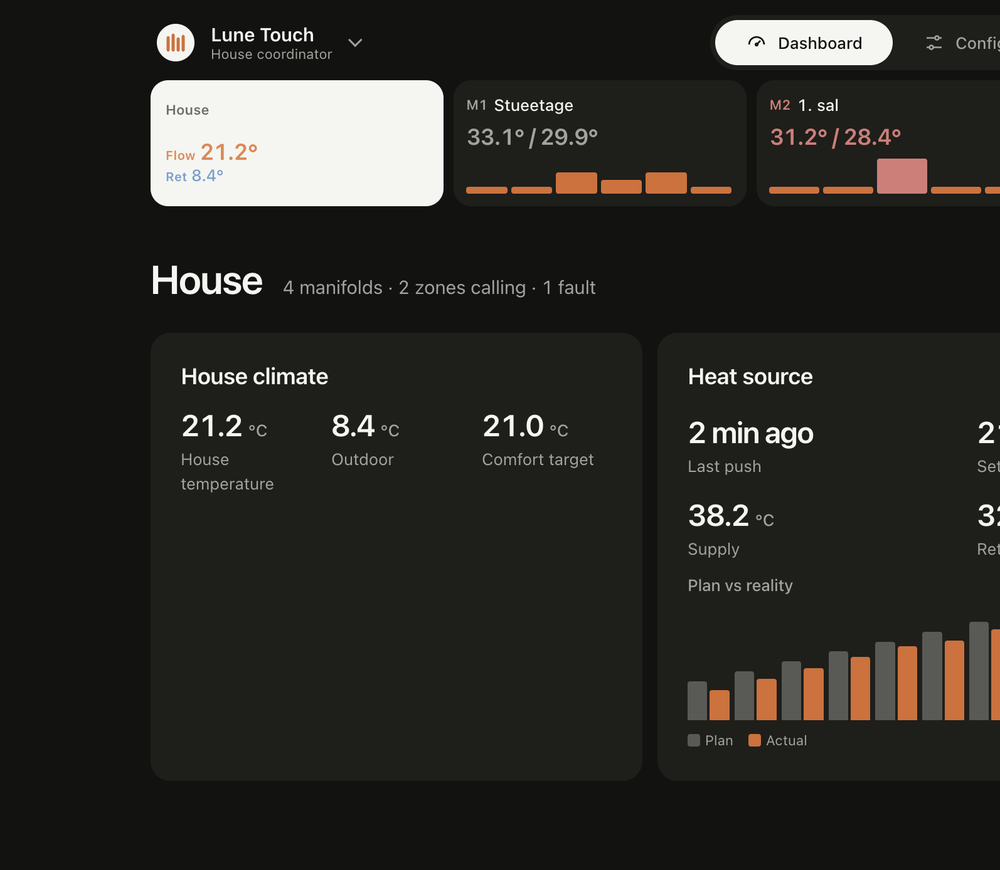

# Lune Design System 2

Fælles designsystem for **Lune V6** og **Lune Touch**: tokens, CSS-komponenter, regler og levende referencesider. Bygget til ESP32 — ren CSS/HTML, tilstand uden JavaScript, ingen eksterne ressourcer, ca. 12–13 kB gzip CSS pr. projekt.

**Repo:** https://github.com/Birkemosen/lune-design-system



*Touch hus-dashboard: hus + manifolds på niveau 1, Asgard-varmekilde med plan vs. virkelighed. Zoner åbnes via understrimmel, når en manifold er valgt.*

## To produkter, én kilde

| | Lune V6 | Lune Touch |
|---|---|---|
| Config | `config/v6.json` | `config/touch.json` |
| Omfang | Manifold + z1–z6 | Hus → manifold (m1–m4) → zone |
| Strimmel | Én række (sys + 6 zoner) | `strip--tiers` + `.substrip` |
| Visninger | Én pr. omfang × mode | Delte: `house` / `manifold` / `zone` × mode |
| Varmekilde | — | Build-time typer (`http`, `asgard`); typed fields uden JS |
| Reference | `examples/v6/` | `examples/touch/` |

Designændringer lander **her først**, derefter genbyg i produkterne. Ret aldrig kun den kopierede CSS/HTML i et produkrepo.

## Filer

| Fil | Indhold |
|---|---|
| [`DESIGN.md`](DESIGN.md) | Principper, komponenter, mønstre, Touch-arkitektur, tjekliste |
| [`AGENTS.md`](AGENTS.md) | Korte regler til kodeagenter |
| `tokens/tokens.json` | Farver, type, afstand, kontrastkrav |
| `css/lune-ui.src.css` | Komponenter og layout (kilde) |
| `config/v6.json`, `config/touch.json` | Omfang og projektflag |
| `tools/lds_build.py` | Tokens + tilstandsregler → `dist/<projekt>/lune-ui.css` |
| `tools/build_docs.py` | → `docs/design-system.html` |
| `examples/v6/` | V6-dashboard (en/da, `web_ui.h`) |
| `examples/touch/` | Touch-dashboard: hierarki + typed varmekilde |

## Kom i gang

```bash
python tools/lds_build.py --check              # kontrast ≥ krav?
python tools/lds_build.py config/v6.json       # → dist/v6/lune-ui.css(.gz)
python tools/lds_build.py config/touch.json    # → dist/touch/lune-ui.css(.gz)
python tools/build_docs.py                     # → docs/design-system.html
python examples/v6/build_ui.py --langs en,da
python examples/touch/build_ui.py --langs en,da --preview --hs-type asgard
# åbn examples/touch/dist/preview-en.html
```

Ukendt værdi i `heat_source_types` fejler buildet med en klar besked.

## Touch i kort form

- **Strimmel:** altid hus + op til 4 manifolds. Zoner (1–6 pr. board) vises i `.substrip`, kun når manifolden eller en af dens zoner er valgt.
- **Navigation:** radioer `#s-house`, `#s-m{N}`, `#s-m{N}z{Z}` — ingen JS til view-state.
- **Varmekilde:** type vælges i Konfiguration med lokale radioer + `.typed-fields` / `.hs-fields` (genereret CSS). UI-id `http` svarer til firmwarens `generic_http`.
- **Regler:** se `AGENTS.md` og `DESIGN.md` §5.2.1, §5.18, §10.

## I produkterne

Checkout som søskende-repo (`../lune-design-system`) eller sync ind.

- **Lune V6** (`Birkemosen/lune`): `lds.yaml` → dette repo; `make design-tokens` / dashboard-build → `lune-v6/web/ui/`
- **Lune Touch** (`Birkemosen/lune-coordinator`): hold `web/design-system/` synkron; byg med `make touch-ui`
- **Lune Touch vægskærm (LVGL)**: `lds.yaml` (schema 2) → `make design-tokens` kører `tools/lds_display.py --install` og skriver `lune_theme.h`, `tokens.generated.yaml`, `lune_design_tokens.h`, brand-PNG'er og `logo.svg` fra `display` i `tokens/tokens.json` og `tokens/brand.json`. `make design-verify` = samme med `--check`. Erstatter det gamle `Birkemosen/lds`.

## Licens

[GPL-3.0-or-later](LICENSE) — samme licens som firmwaren, der indlejrer designsystemet.

"Lune" identificerer projektet. Forks skal bruge et andet navn og må ikke fremstå som Lune
eller som godkendt af projektet.

## Støt projektet

Lune udvikles i fritiden for egne penge. Vil du give noget igen, kan du sponsorere det via
[GitHub Sponsors](https://github.com/sponsors/Birkemosen).
