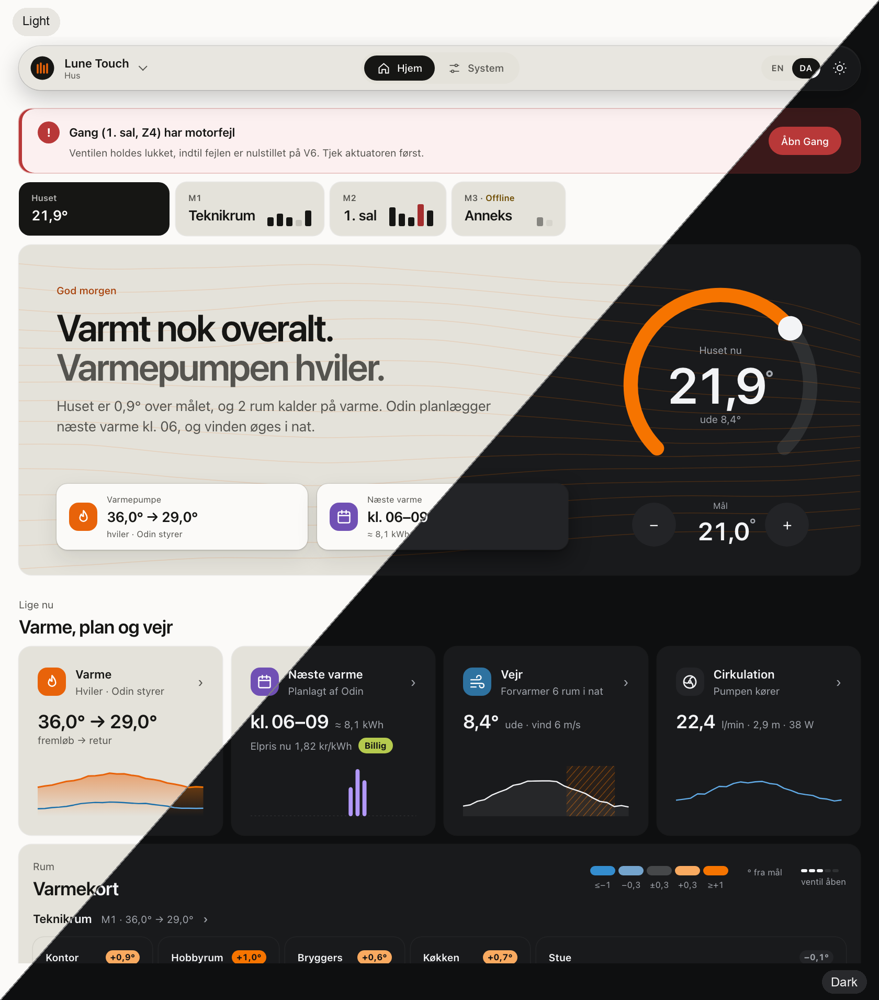

# Lune Design System 2

Fælles designsystem for **Lune V6** og **Lune Touch**: tokens, CSS-komponenter, regler og en visuel reference. Bygget til ESP32: ren CSS/HTML, tilstand uden JavaScript, ingen eksterne ressourcer.

**Dokumentation:** [docs/README.md](docs/README.md) — indeks over designsystemets dokumenter, med links til Lune V6 og Lune Touch.

**Repo:** https://github.com/Birkemosen/lune-design-system



Designændringer lander **her først**, derefter genbyg i produkterne. Ret aldrig kun den kopierede CSS/HTML i et produktrepo. Se [`CHANGELOG.md`](CHANGELOG.md).

| Fil | Indhold |
|---|---|
| [`DESIGN.md`](DESIGN.md) | Principper, farvebetydning, typografi, layout, alle komponenter, mønstre, sprog, i18n, budget, Touch-arkitektur, tjekliste |
| [`AGENTS.md`](AGENTS.md) | Korte regler til kodeagenter — kopiér ind i projektets `CLAUDE.md` |
| `tokens/tokens.json` | Alle værdier (lys + mørk) og kontrastkrav |
| `css/lune-ui.src.css` | Komponenter og layout (kilde) |
| `config/v6.json`, `config/touch.json` | Projektets tilstande (Hjem/System), System-kategorier og flag (`heat_source_types`, `typed_groups`) |
| `tools/lds_build.py` | Bygger `dist/<projekt>/lune-ui.css` og tjekker kontrast |
| `tools/build_docs.py` | Bygger `docs/design-system.html` |
| `tools/lds_ha.py` | Bygger Home Assistant-temaet (`dist/home-assistant/`) |
| `tools/lds_display.py` | Bygger vægskærmens LVGL-tema (`dist/display/lune_theme.h` og ESPHome-pakke); `--install` skriver firmwarefilerne i produktrepoet |
| `tools/lds_brand.py`, `tokens/brand.json` | Brand-mærker (seksrørs-halo) som PNG/SVG |
| `tools/md_toc.py` | Indholdsfortegnelser i Markdown (`<!-- toc -->`), fx i `DESIGN.md` og manualerne |
| `js/lune-forms.js` | Ugemt/gem, autogem og placering af popovers (progressiv) |
| `examples/v6/` | V6 på systemet (Hjem, zone- og manifold-ark, System), med en/da og `web_ui.h` |
| `examples/touch/` | Touch på systemet: Hjem med termostatring, felter og varmekort, ark og System |

## Kom i gang

```bash
python tools/lds_build.py --check              # alle farvepar ≥ kravet?
python tools/lds_build.py config/v6.json       # → dist/v6/lune-ui.css(.gz)
python tools/lds_build.py config/touch.json    # → dist/touch/lune-ui.css(.gz)
python tools/build_docs.py                     # → docs/design-system.html
python tools/lds_display.py                    # → dist/display/lune_theme.{h,yaml}
python tools/lds_ha.py                         # → dist/home-assistant/themes/lune.yaml
python examples/v6/build_ui.py --langs en,da   # → examples/v6/dist (sider + web_ui.h)
python examples/v6/check_fields.py             # ingen gamle felter forsvundet, grænser for grupper
python examples/touch/build_ui.py --langs en,da --preview --hs-type asgard
```

Ukendt værdi i `heat_source_types` eller `typed_groups` fejler buildet med en klar besked.

## I de to projekter

Læg mappen som git-submodule (eller kopi) i hvert repo, fx `web/design-system/`. Projektets egen build kalder `lds_build.py` med sin config og bruger `dist/<projekt>/lune-ui.css`. Sider bygges efter mønsteret i `examples/v6/build_ui.py`: state-inputs før `.app`, én `section.view` pr. tilstand × omfang, tekster fra i18n-kataloget.

- **Lune V6** (`Birkemosen/lune`): `lds.yaml` → dette repo; `make design-tokens` / dashboard-build → `lune-v6/web/ui/`
- **Lune Touch** (`Birkemosen/lune-coordinator`): hold `web/design-system/` synkron; byg med `make touch-ui`. Touch-arkitekturen står i `DESIGN.md` afsnit 10 og 5.2.1.
- **Lune Touch vægskærm (LVGL)**: `lds.yaml` (schema 2) → `make design-tokens` kører `tools/lds_display.py --install` og skriver `lune_theme.h`, `tokens.generated.yaml`, `lune_design_tokens.h`, brand-PNG'er og `logo.svg` fra `display` i `tokens/tokens.json` og `tokens/brand.json`. `make design-verify` = samme med `--check`.

## Licens

[GPL-3.0-or-later](LICENSE) — samme licens som firmwaren, der indlejrer designsystemet.

"Lune" identificerer projektet. Forks skal bruge et andet navn og må ikke fremstå som Lune
eller som godkendt af projektet.

## Støt projektet

Lune udvikles i fritiden for egne penge. Vil du give noget igen, kan du sponsorere det via
[GitHub Sponsors](https://github.com/sponsors/Birkemosen).
